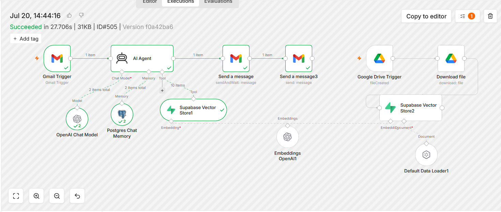

# RAG-Based Email Customer Support Agent

An AI-powered email customer support automation built with **n8n, RAG, OpenAI, Supabase Vector Store, PostgreSQL Memory, Google Drive, and Gmail**.

The system retrieves relevant information from a knowledge base before generating a response to incoming customer emails.

---

## 📌 Project Overview

This project demonstrates a **Retrieval-Augmented Generation (RAG)** workflow for automated email customer support.

The system consists of two main processes:

- **Knowledge Base Ingestion** — documents stored in Google Drive are processed, chunked, converted into embeddings, and stored in Supabase Vector Store.
- **Live Query Answering** — incoming customer emails are processed by an AI Agent, which retrieves relevant information from the vector store before generating and sending a response.

---

## 🏗️ System Architecture

### 1. Knowledge Base Ingestion

```text
Google Drive Trigger
        ↓
Download File
        ↓
Default Data Loader
        ↓
OpenAI Embeddings
        ↓
Supabase Vector Store
```

The knowledge base document is stored in Google Drive. The workflow detects the document, downloads it, processes and chunks the content, generates embeddings, and stores the resulting vectors in Supabase Vector Store.

### 2. Live Query Answering

```text
Gmail Trigger
        ↓
Email Content Processing
        ↓
AI Agent
        ↓
Supabase Vector Store
        ↓
Retrieve Relevant Knowledge
        ↓
AI Response Generation
        ↓
Gmail Send
```

When a customer sends an email, the Gmail Trigger captures the incoming message. The processed query is passed to the AI Agent, which uses the Supabase Vector Store to retrieve relevant knowledge before generating the response.

---

## 🔎 RAG Process

The Retrieval-Augmented Generation process works as follows:

1. Knowledge base documents are stored in Google Drive.
2. The Google Drive Trigger detects the document.
3. The document is downloaded.
4. The Default Data Loader loads and chunks the document.
5. OpenAI Embeddings convert the document content into vector representations.
6. The embeddings are stored in Supabase Vector Store.
7. A customer email is received through Gmail.
8. The email content is extracted and cleaned.
9. The processed query is sent to the AI Agent.
10. The query embedding is used to retrieve semantically similar information from the vector store.
11. Relevant context is retrieved from the knowledge base.
12. The AI combines the customer query with the retrieved context.
13. The AI generates a context-aware response.
14. The response is sent to the customer through Gmail.

---

## 🛠️ Technology Stack

- **n8n** — workflow automation and integration
- **OpenAI** — LLM-based response generation
- **OpenAI Embeddings** — converts document and query text into vector representations
- **Supabase Vector Store** — stores embeddings and enables semantic search
- **PostgreSQL Chat Memory** — maintains conversation context
- **Gmail API** — receives and sends customer emails
- **Google Drive** — stores the knowledge base document
- **Default Data Loader** — loads and chunks documents

---

## ✨ Key Features

- Retrieval-Augmented Generation (RAG)
- Automated knowledge-base ingestion
- Document loading and chunking
- Vector embedding generation
- Semantic knowledge retrieval
- AI-powered customer email responses
- Gmail integration
- PostgreSQL conversation memory
- Automated document processing
- Human-in-the-loop approval workflow

---

## 🧠 AI Agent

The AI Agent processes incoming customer queries and uses the Supabase Vector Store as a knowledge retrieval tool.

The agent can combine:

- Customer query
- Retrieved knowledge-base context
- Conversation history

to generate a context-aware response.

---

## 💾 Conversation Memory

The workflow uses **PostgreSQL Chat Memory** to maintain conversation context.

This allows the system to preserve relevant information across interactions instead of treating every message as an isolated query.

---

## 👤 Human-in-the-Loop

The project also includes a human review process for customer responses.

```text
Customer Email
      ↓
   AI Agent
      ↓
Draft Response
      ↓
 Human Review
    ↙     ↘
Approve   Reject
   ↓
Send Email
```

The AI generates a draft response first. A human can review the response and approve or reject it.

Only approved responses are sent to the customer.

---

## 💼 Potential Use Cases

The architecture can be adapted for:

- E-commerce customer support
- Healthcare appointment systems
- Banking customer support
- Internal knowledge-base support systems

---

## ⚠️ Challenges & Limitations

- Response quality depends on the quality of the knowledge base.
- Embedding and LLM APIs may involve usage costs.
- Complex queries may reduce response accuracy.
- Privacy and security need to be considered when handling customer information.

---

## 📸 Workflow

The complete n8n workflow combines knowledge-base ingestion, RAG retrieval, AI response generation, conversation memory, and email delivery.



---

## 🔧 Workflow Components

### Knowledge Base Pipeline

```text
Google Drive Trigger
        ↓
Download File
        ↓
Default Data Loader
        ↓
OpenAI Embeddings
        ↓
Supabase Vector Store
```

### Customer Email Pipeline

```text
Gmail Trigger
        ↓
AI Agent
        ↓
Supabase Vector Store
        ↓
PostgreSQL Chat Memory
        ↓
Gmail Send
```

### AI Agent Components

- OpenAI Chat Model
- PostgreSQL Chat Memory
- Supabase Vector Store

---

## 📋 Complete Workflow Overview

```text
                 KNOWLEDGE BASE
                       │
                       ▼
                 Google Drive
                       │
                       ▼
                  Download File
                       │
                       ▼
               Default Data Loader
                       │
                       ▼
                OpenAI Embeddings
                       │
                       ▼
              Supabase Vector Store
                       │
                       │ Retrieval
                       │
                       ▼
                  CUSTOMER EMAIL
                       │
                       ▼
                  Gmail Trigger
                       │
                       ▼
                    AI Agent
                   /    |    \
                  /     |     \
                 ▼      ▼      ▼
        OpenAI Chat   PostgreSQL   Supabase
           Model       Memory       Vector Store
                  \     |     /
                   \    |    /
                    ▼   ▼   ▼
              Relevant Context
                       │
                       ▼
              Generated Response
                       │
                       ▼
                  Gmail Send
```

---

## 📁 Project Structure

```text
ai-rag-customer-support-agent/
│
├── README.md
│
├── workflow/
│   └── workflow.json
│
├── screenshots/
│   └── workflow.png
│
└── docs/
    └── architecture.png
```

---

## 🚀 Project Highlights

### RAG Knowledge Retrieval

Uses document embeddings and **Supabase Vector Store** to retrieve relevant information from the knowledge base before generating customer responses.

### Automated Knowledge-Base Ingestion

Documents stored in Google Drive are automatically processed, chunked, embedded, and stored in the vector database.

### AI-Powered Customer Support

An AI Agent processes incoming customer emails and generates responses using retrieved knowledge from the knowledge base.

### Semantic Search

Customer queries are converted into embeddings and used to retrieve semantically similar knowledge-base content.

### Conversation Memory

PostgreSQL Chat Memory maintains conversation context for ongoing customer interactions.

### Human Review

A human approval step can be used to review AI-generated customer responses before they are sent.

### Multi-Service Integration

The workflow integrates:

- n8n
- Gmail
- Google Drive
- OpenAI
- Supabase
- PostgreSQL

into a single automation system.

---

## 📂 Workflow File

The n8n workflow JSON is included in the `workflow` directory.

The workflow can be imported into n8n and configured with the required credentials and services.

> **Note:** API credentials, OAuth tokens, passwords, and other private configuration values are not included in this repository.

---

## 🔐 Security Note

Before importing or sharing the workflow:

- Configure your own API credentials.
- Configure your own Gmail account.
- Configure your own Google Drive connection.
- Configure your own Supabase project.
- Do not expose API keys, OAuth tokens, passwords, or private credentials.

---

## 📌 What This Project Demonstrates

This project demonstrates practical experience with:

- RAG architecture
- Vector databases
- Embeddings
- Semantic retrieval
- AI Agents
- LLM integration
- Workflow automation
- Gmail automation
- Google Drive automation
- PostgreSQL conversation memory
- Human-in-the-loop workflows
- Multi-service API integration

---

## 📫 Author

**Sabuj Chandra Das**

AI Automation Engineer

**Portfolio:** https://sabuj-chandra-das.lovable.app

**GitHub:** https://github.com/sabuj-chandra-das
